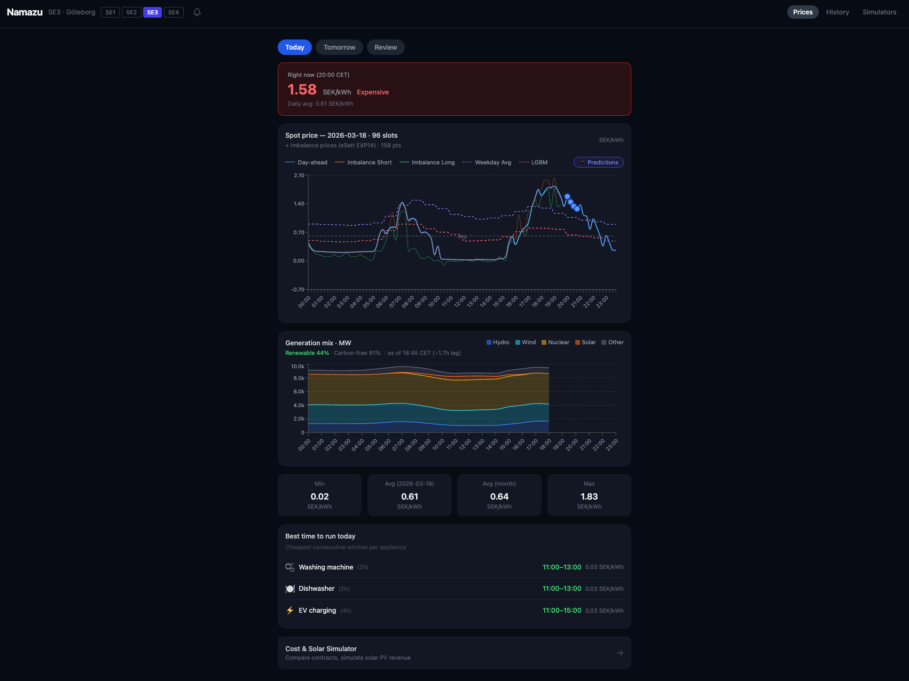

# Unagi — Swedish Electricity Price Forecast

> *Catch an E[el] for now and then.*

**[unagieel.net](https://unagieel.net)**



## What is this?

Unagi forecasts Swedish electricity spot prices up to 7 days ahead using machine learning, and shows you how accurate those forecasts actually are.

- **Hourly spot prices** for all four zones (SE1–SE4) with cheapest-window highlights
- **7-day ML forecast** — LightGBM trained on 365 days of price, weather, generation, and market data
- **Prediction accuracy on display** — MAE, prediction vs actual overlays, 80% confidence intervals with calibration tracking
- **Generation mix** — hydro, wind, nuclear, solar breakdown with carbon intensity
- **Cost simulators** — compare fixed vs dynamic contracts, estimate solar PV revenue
- **Free JSON feed** — all forecasts as machine-readable files at [catch.unagieel.net](https://catch.unagieel.net/v1/index.json), no key required
- **Light & dark themes** — marine blue by day, deep sea by night

No account required. No ads. Source available.

## How accurate is it?

Unagi measures its own forecasts against reality and publishes the results live: MAE, 80% interval coverage, and per-horizon error over a rolling 28-day window — in the dashboard and inside every feed file. No figure is quoted here on purpose: a single accuracy number mostly reflects how volatile the last month was, so read the `accuracy` field and judge for yourself. Every day's forecast is also frozen in a [public archive](https://catch.unagieel.net/v1/index.json), so past predictions can't be silently rewritten.

The model (LightGBM, 61 features, Huber loss) is retrained daily on 365 days of data from ENTSO-E, SMHI, eSett, and Riksbank. Prediction intervals are calibrated using conformal quantile regression.

## Public forecast feed

Everything the dashboard shows is available as plain JSON — no account, no API key:

```bash
curl https://catch.unagieel.net/v1/forecast/SE3.json
```

| URL | Contents |
|-----|----------|
| `/v1/index.json` | Area list + latest generation time |
| `/v1/forecast/{SE1..SE4}.json` | Today + 7 days ahead, hourly. Settled days (`kind: "actual"`) carry the real price with the prior forecast kept alongside; future days carry point + 80% band. Cheapest hours per day, live accuracy |
| `/v1/archive/{YYYY-MM-DD}/{AREA}.json` | Frozen daily snapshots (audit trail) |

Timestamps are ISO 8601 with Europe/Stockholm offsets; prices are SEK/kWh excl. VAT, grid fees and retailer markup. Free for personal, non-commercial use with attribution — see [LICENSE.md](LICENSE.md). Updated a few times daily after Nord Pool publication; cache-friendly (15 min).

## Data sources

| Source | What | Update |
|--------|------|--------|
| [ENTSO-E](https://transparency.entsoe.eu/) | Day-ahead prices, generation mix | Hourly |
| [SMHI](https://www.smhi.se/) | Solar irradiance, temperature, wind | Hourly |
| [eSett](https://www.esett.com/) | Imbalance / balancing prices | 15-min |
| [Riksbank](https://www.riksbank.se/) | EUR/SEK exchange rate | Daily |

## Run locally

```bash
git clone git@github.com:mugime-shi/Unagi.git && cd Unagi
docker compose up                                  # API on :8100
cd frontend && npm install && npm run dev          # Next.js on :3000
```

Requires a `.env` file — see `.env.example` for required keys.

## Architecture

```
React 19 (Vercel) → API Gateway → Lambda (FastAPI) → PostgreSQL (Supabase)
                                       ↑
                    EventBridge crons: price fetch, ML predictions, notifications
                    CloudWatch → SNS → Telegram alerts
                                       │
                                       └→ Cloudflare R2 → catch.unagieel.net
                                          (public JSON feed, CDN-served)
```

Full details: **[System Design](docs/SYSTEM_DESIGN.md)** · **[API Reference](docs/API.md)**

## Tech stack

Python 3.12 · FastAPI · LightGBM · Optuna · Next.js 16 · React 19 · TypeScript · Tailwind CSS · Recharts · AWS Lambda (arm64) · Terraform · GitHub Actions

## License

Source available — free to read and run locally for personal, non-commercial use. Any other use (including commercial): contact hello@unagieel.net. See [LICENSE.md](LICENSE.md).

## Contributing

Bug reports and feedback welcome — open an issue or email hello@unagieel.net. The ML model, feature engineering, and training pipeline are all in `backend/app/services/` and `backend/scripts/`.

## Author

**Mugimeshi** — Gothenburg, Sweden
